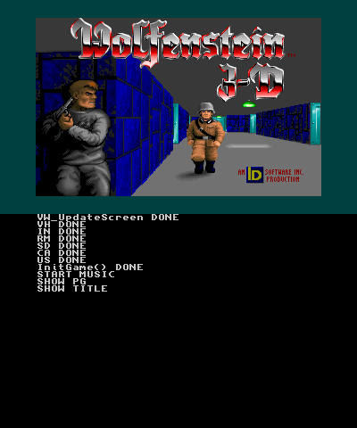
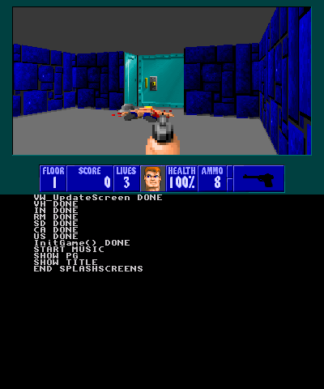

# Wolf4SDL-3DS

Port of Wolfenstein 3D to Nintendo 3DS using Wolf4SDL as a base.

Runs at about 50-60 fps on both o3ds and n3ds.

Requires a copy of `Wolf3d Full v1.4 GT/ID/Activision` or `Wolf3d shareware version v1.4`

Download and copy `wolf4sdl.3dsx` or `wolf4sdl-shareware.3dsx` from the [releases](https://github.com/hax0kartik/wolf4sdl-3ds/releases/latest) page to `sdmc:/3ds/wolf4sdl` and the `*.wl6`/`*.wl1` files to `sdmc:/3ds/wolf4sdl/wolf3d/`

## Controls
| Keys | Controls |
| :-: |:-:|
| A / ZR | Fire |
| B | Use |
| X | Strafe |
| Y / ZL | Run |
| L | Cycle through weapons (Strong > Weak) |
| R | Cycle through weapons (Weak > Strong) |
| CPAD AND DPAD | Move Around |
| START | Enter(Select in main menu) 

## Building

Building requires latest `ctrulib` and `sdl1.2` 3ds port.
You can install them using dkp-pacman

## Screenshots

## Credits
* All wolf4sdl contributors
* Devkitpro
* Keeganatorr for wold4sdl switch port
* Druivensap, DreadKnight for helping me test